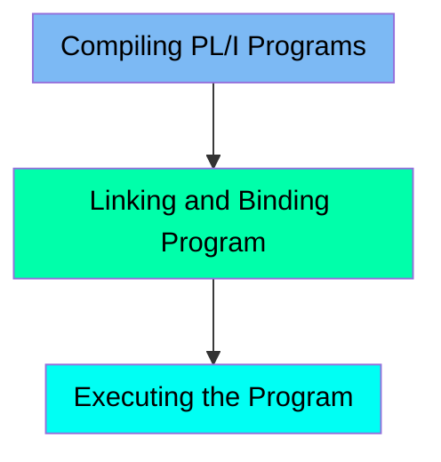

The PLCMPLER job is responsible for compiling, linking, and executing PL/I programs. It sets up the necessary runtime libraries, specifies the source and output datasets, and handles the compilation process using the IBMZPLI compiler. After compilation, it links and binds the compiled program to create an executable load module using the IEWBLINK program. Finally, it executes the compiled program, managing the input and output datasets.

For example, if the source member is PLI002, the job will compile this member, link and bind it to create an executable, and then run the executable with the specified input and output datasets.

Here is a high level diagram of the file:

## Compiling PL/I Programs

Steps in this section: `PLI`.

This section is responsible for compiling PL/I programs using the IBMZPLI compiler. It sets up the necessary runtime libraries, specifies the source and output datasets, and handles the compilation process.

## Linking and Binding Program

Steps in this section: `BIND`.

This section is responsible for linking and binding the compiled PL/I program to create an executable load module. It uses the IEWBLINK program to perform the linking and binding process, ensuring that the compiled output is properly stored in the specified load library.

## Executing the Program

Steps in this section: `EXECUTE`.

This section is responsible for executing the compiled PL/I program using the specified runtime and data libraries, and managing the input and output datasets.

&nbsp;

*This is an auto-generated document by Swimm 🌊 and has not yet been verified by a human*

<SwmMeta version="3.0.0" repo-id="Z2l0aHViJTNBJTNBbWFpbmZyYW1lJTNBJTNBU3dpbW0tRGVtbw==" repo-name="mainframe">Powered by [Swimm](/)</SwmMeta>
