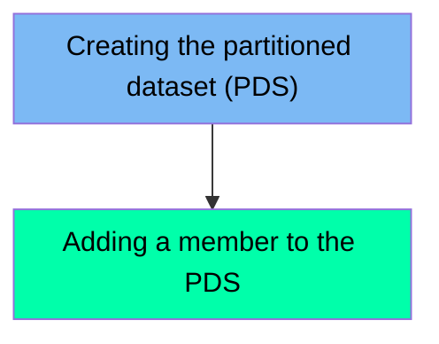

This document describes the NEWPDSM job, which is responsible for creating a new partitioned dataset (PDS) and adding a member to it. The process is achieved by executing two main steps: creating the PDS with the necessary space and data control block (DCB) parameters, and then adding a new member to the created PDS. The input for this job includes the PDS library name and the member name, and the output is the newly created PDS with the specified member added.

For example, if the PDS library name is set to 'FERMYNO.LIBS.CRUDPS' and the member name is set to 'TESTE', the job will create a new PDS with these specifications and add the member 'TESTE' to it.

Here is a high level diagram of the file:

## Creating the partitioned dataset (PDS)

Steps in this section: `STEP001`.

This section is responsible for creating a new partitioned dataset (PDS) using the IEFBR14 utility program. It sets up the necessary space and data control block (DCB) parameters for the new dataset.

## Adding a member to the PDS

Steps in this section: `STEP002`.

This section is responsible for adding a new member to an existing Partitioned Data Set (PDS) using the IEBGENER utility.

&nbsp;

*This is an auto-generated document by Swimm 🌊 and has not yet been verified by a human*

<SwmMeta version="3.0.0" repo-id="Z2l0aHViJTNBJTNBbWFpbmZyYW1lJTNBJTNBU3dpbW0tRGVtbw==" repo-name="mainframe">Powered by [Swimm](/)</SwmMeta>
