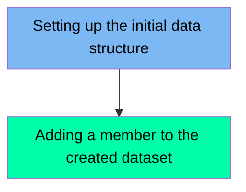

The NEWPDSE1 job is designed to create a Partitioned Data Set Extended (PDSE) and add a member to it. This process is achieved by first setting up the initial data structure using the IEFBR14 utility program, followed by adding a member to the created dataset using the ICEGENER program.

For example, the job creates a new PDSE dataset named 'FERMYNO.TEST.PDSE1' and then adds a member named 'MEMBER1' to this dataset.

Here is a high level diagram of the file:

## Setting up the initial data structure

Steps in this section: `STEP10`.

This section is about setting up the initial data structure by creating a new PDSE dataset and member using the IEFBR14 utility program. This setup facilitates subsequent data operations in the mainframe environment.

## Adding a member to the created dataset

Steps in this section: `STEP20`.

This section is responsible for adding a new member to an already created PDSE dataset. It uses the ICEGENER program to generate the control records necessary for this operation.

&nbsp;

*This is an auto-generated document by Swimm 🌊 and has not yet been verified by a human*

<SwmMeta version="3.0.0" repo-id="Z2l0aHViJTNBJTNBbWFpbmZyYW1lJTNBJTNBU3dpbW0tRGVtbw==" repo-name="mainframe">Powered by [Swimm](/)</SwmMeta>
