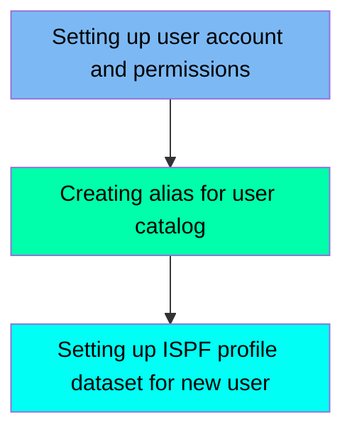

In our mainframe system, the NEWUSER1 job is used to create a new user account with administrative privileges. This process involves defining user attributes, connecting the user to various groups, and setting up the necessary permissions for accessing system resources. Additionally, an alias is created for the user catalog to facilitate authentication and access management, and an ISPF profile dataset is set up to allow for user-specific settings and storage options.

For example, when creating a new user named 'FERMYNO', the job will set up the user with the username 'FERMYNO GUTIERREZ', assign the password 'NEWPASS1', and configure the user's home directory and default shell program.

Here is a high level diagram of the file:

## Setting up user account and permissions

Steps in this section: `RACF`.

This section is about creating a new user account and assigning the necessary permissions. It involves defining the user attributes, connecting the user to various groups, and setting up the required permissions for accessing different system resources.

## Creating alias for user catalog

Steps in this section: `ALIAS`.

This section is about adding an alias to the user catalog to facilitate user authentication and access management.

## Setting up ISPF profile dataset for new user

Steps in this section: `ISPF`.

This section is responsible for creating an ISPF profile dataset, which allows for user-specific settings and storage options in the ISPF environment. This setup is essential for customizing and personalizing the user experience on the mainframe.

&nbsp;

*This is an auto-generated document by Swimm 🌊 and has not yet been verified by a human*

<SwmMeta version="3.0.0" repo-id="Z2l0aHViJTNBJTNBbWFpbmZyYW1lJTNBJTNBU3dpbW0tRGVtbw==" repo-name="mainframe">Powered by [Swimm](/)</SwmMeta>
