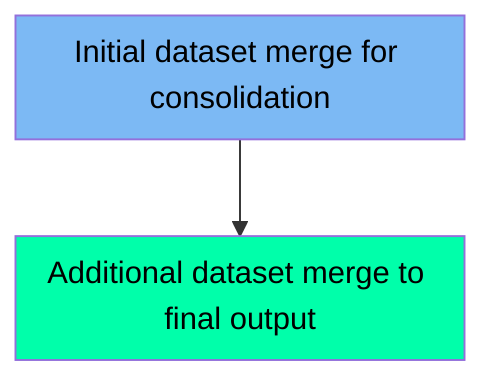

The MERGEDT1 job is used for merging datasets in the system. This job involves two main steps: initially merging two input datasets into a single output dataset, and then merging an additional dataset into the final output dataset. The input datasets are specified as DD1 and DD2, and the output dataset is specified as DD3. The IEBCOPY utility is used to perform the merging operations.

For example, the job first merges FERMYNO.TEST.PDS1 into FERMYNO.TEST.PDS3, and then merges FERMYNO.TEST.PDS2 into FERMYNO.TEST.PDS3, resulting in a consolidated dataset.

Here is a high level diagram of the file:

## Initial dataset merge for consolidation

Steps in this section: `STEP001`.

This section is about merging two input datasets into a single output dataset using the IEBCOPY utility. The merged dataset will be used for further processing and consolidation.

## Additional dataset merge to final output

Steps in this section: `STEP002`.

This section is about merging an additional dataset into the final output dataset. The program uses IEBCOPY to merge the contents of FERMYNO.TEST.PDS2 into FERMYNO.TEST.PDS3.

&nbsp;

*This is an auto-generated document by Swimm 🌊 and has not yet been verified by a human*

<SwmMeta version="3.0.0" repo-id="Z2l0aHViJTNBJTNBbWFpbmZyYW1lJTNBJTNBU3dpbW0tRGVtbw==" repo-name="mainframe">Powered by [Swimm](/)</SwmMeta>
